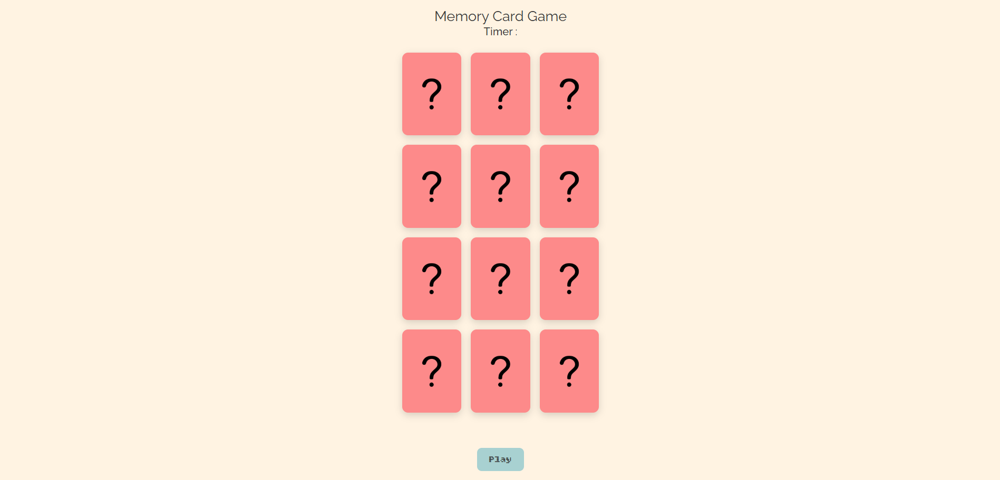

# 🎮🎮 Memory Card Game

## 🕹️ Description

This is a simple memory card game, made with HTML, CSS, and JavaScript.  
Test your memory with this fast-paced Memory Card Game!
At the start, all cards briefly reveal their icons use that time to memorize their positions.
Flip two cards at a time. If they match, they stay face-up. If not, they flip back.
Match all pairs before time runs out to win. Stay sharp and have fun!

## 🚀 Getting Started

👉 **Play it here:** [https://yusuf-qamber.github.io/Memory-card-game/](https://yusuf-qamber.github.io/Memory-card-game/)

👉 **Planning Materials:**

- [User Stories](/userStories.md)
- [Wireframe](/assets/memory-card-game.png)

### How to Play

1. Open the link to the game.
2. Press the play button.
3. Memorize the cards during the brief preview.
4. Flip two cards at a time to find matching pairs.
5. Match all pairs before the timer runs out to win the game!

## 💡 Technologies Used

- HTML
- CSS
- JavaScript

## 📚 Attributions

- [Icons from Flaticon](https://www.flaticon.com/)

## 🚧 Next Steps

- Add sound effects
- Add a dark mode
- Make it work on phones
